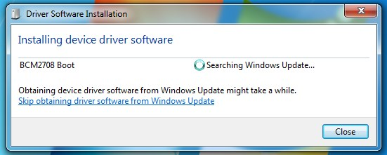
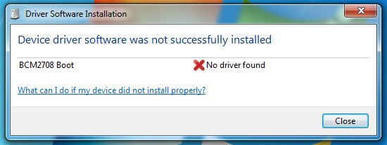
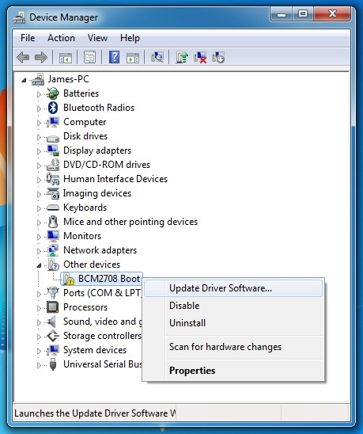
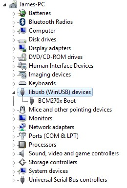

# Flashing the Compute Module eMMC

The Compute module has an on-board eMMC device connected to the primary SD card interface. This guide explains how to write data to the eMMC storage using a Compute Module IO Board.

Please also read the section on [Module booting and flashing the eMMC](cm-designguide.md#modulebootingandflashing) in the [Compute Module Hardware Design Guide](cm-designguide.md)

## Steps to flash the eMMC on a Compute Module

You need a host Linux system; a Raspberry Pi is recommended but you should be able to use any recent Linux distribution and you can also now use this tool via Cygwin on Windows.

Note that there is a bug in the BCM2835 bootloader which returns a slightly incorrect USB packet to the host. Most USB hosts seem to ignore this benign bug and work OK, however we do see some USB ports that due to this bug do not work. We don't quote understand why some ports fail - it doesn't seem to be correlated with whether they are USB2 or USB3 (we have seen both types working) but is likely specific to the host controller and driver.

**For Windows Users**

To use the tool under Cygwin on Windows firstly you'll need to install [Cygwin](https://www.cygwin.com/). You'll need to make sure to install the libusb-1.0 and libusb-1.0-devel packages (NB tested using version 1.0.19-1) as well as gcc and Make.

You then need to install the Windows driver which can be downloaded here: [bcm270x-boot-driver.zip](bcm270x-boot-driver.zip). To install the driver firstly plug the host machine into the Compute Module IO Board USB slave port (J15) and power on the CMIO board. Windows will see a new USB hardware device "BCM2708 Boot".



Select "Skip obtaining driver software from Windows Update" (or wait) and the driver will not be found. Close the dialog box.



Go to Windows Device Manager and you'll see an unknown device with a yellow exclamation mark under Other Devices->BCM2708 Boot



Right click on this unknown device and select "Update Driver Software", then select "Browse my computer for driver software". In the next dialog box select "Browse" and browse to the directory containing the unzipped bcm270x-boot-driver.zip (the directory containing bcm270x.inf) and select "Next". Finally click "Install this driver software anyway" when Windows complains it cannot verify the publisher.

After a short while the driver will finish being installed and you should be able to see it in Device Manager.



Finally follow the remainder of the instructions below (in a Cygwin terminal) **Note that when performing the below commands in a Cygwin terminal don't prefix them with sudo.**

**On your Compute Module IO Board:**

Make sure that J4 (USB SLAVE BOOT ENABLE) is set to the 'EN' position.

**On your host system:**

Git may produce an error if the date is not set correctly, so on a Raspberry Pi enter the following:

```bash
sudo date MMDDhhmm
```

where MM is month, DD day and hh mm hours and minutes respectively.

Clone the usbboot tool repository:

```bash
git clone --depth=1 https://github.com/raspberrypi/tools
cd tools/usbboot
```

libusb must be installed. If you are using Cygwin please make sure libusb is installed as previously described.
On the Raspberry Pi or other Debian based Linux:

```bash
sudo apt-get install libusb-1.0-0-dev
```

Now build and install the usbboot tool:

```bash
make
sudo make install
```

Run the usbboot tool and it will wait for a connection:

```bash
sudo rpiboot
```

Now plug the host machine into the Compute Module IO Board USB slave port (J15) and power on the CMIO board. The usbboot tool will discover the Compute Module and send boot code to allow access to the eMMC. 

## Writing to the eMMC - Cygwin

After running rpiboot a new USB mass storage drive will appear in Windows. We recommend following this [guide](../../installation/installing-images/windows.md) and using Win32DiskImager to write images to the drive, rather than trying to use /dev/sda etc. from Cygwin.

## Writing to the eMMC - Linux

Once complete you will see a new device appear; this is commonly /dev/sda but it could be another location such as /dev/sdb, so check in /dev/ before running rpiboot so you can see what changes.

You now need to write a raw OS image (such as [Raspbian](http://downloads.raspberrypi.org/raspbian_latest)) to the device. Note the following command may take some time to complete, depending on the size of the image:

```bash
sudo dd if=raw_os_image_of_your_choice.img of=/dev/sda bs=4MiB
```

Once the image has been written, unplug and re-plug the USB; you should see 2 partitions appear (for Raspian) in /dev. In total you should see something similar to this:

```bash
/dev/sda    <- Device
/dev/sda1   <- First partition (FAT)
/dev/sda2   <- Second partition (Linux filesystem)
```

The `/dev/sda1` and `/dev/sda2` partitions can now be mounted normally.

Make sure J4 (USB SLAVE BOOT ENABLE) is set to the disabled position and/or nothing is plugged into the USB slave port. Power cycling the IO board should now result in the Compute Module booting from eMMC.
