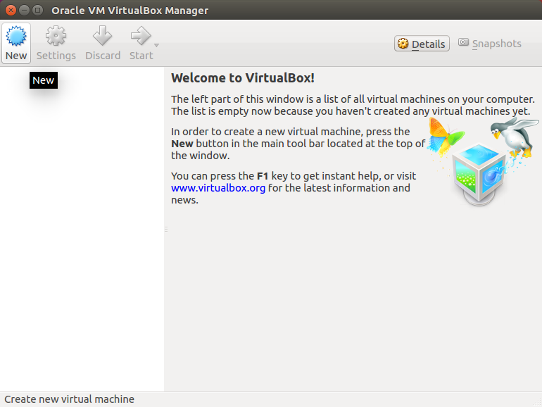
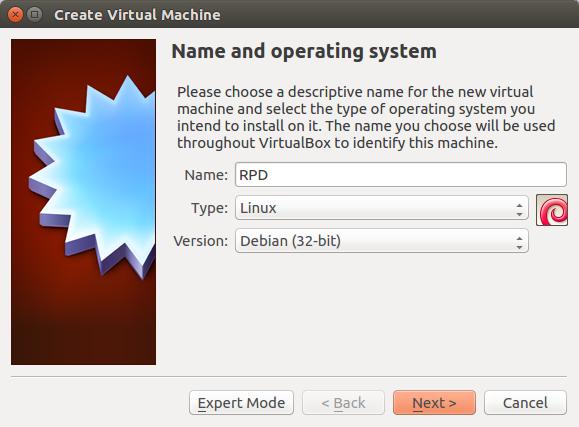
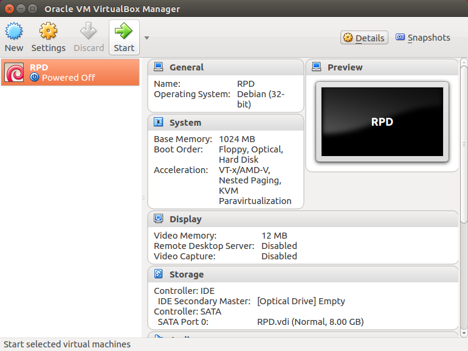
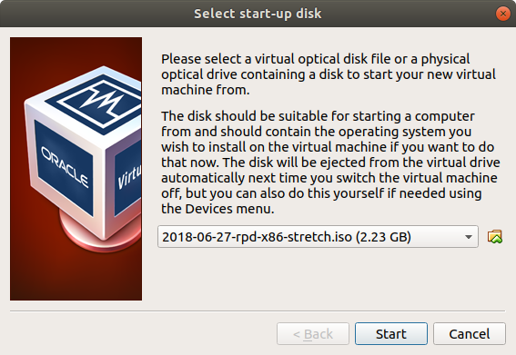
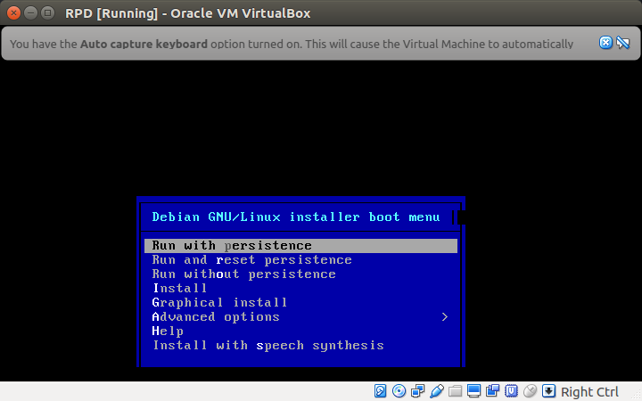
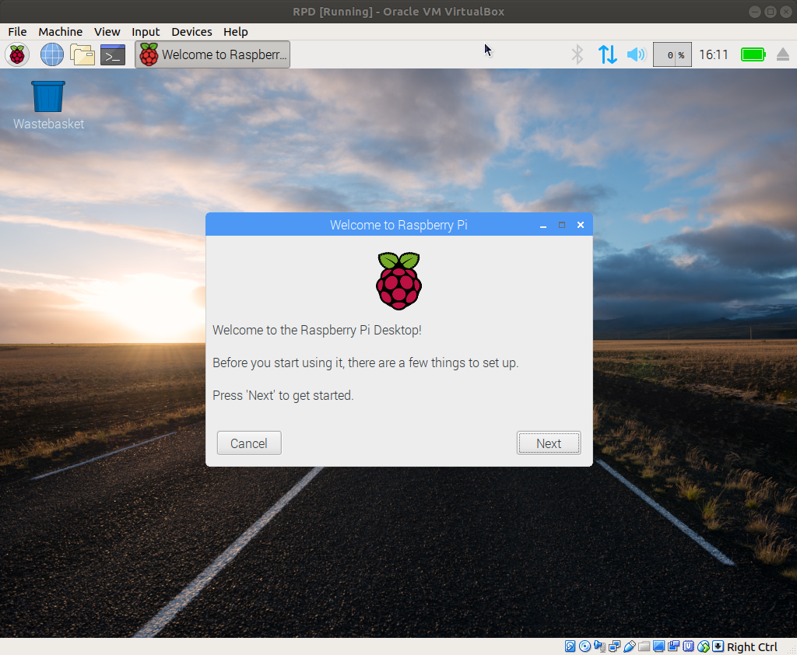

# Running Raspberry Pi Desktop in a virtual machine

Follow this guide to install the Debian-based Raspberry Pi Desktop image in a
virtual machine using [VirtualBox](https://www.virtualbox.org/).

1. Install VirtualBox on your PC or Mac.

    - On Linux, install with your package manager, e.g. `sudo apt install virtualbox`.
    - On Mac or Windows, download from [www.virtualbox.org/wiki/Downloads](https://www.virtualbox.org/wiki/Downloads).

1. Download the latest image from the Raspberry Pi website's [Downloads page](https://www.raspberrypi.org/downloads/).

1. Launch VirtualBox and click the **New** button:

    

1. Give your VM a name, and select **Linux** and **Debian (32-bit)**:

    

1. Select the amount of RAM and disk space you would like to make available to
your VM. 1GB (1024MB) RAM and 8GB disk space should be sufficient (i.e. the same
as a Raspberry Pi 3 with an 8GB SD card).

1. Continue with the setup. The default options for the following screens will
be fine (unless you want to change them)

1. Now click the **Start** button to boot your VM:

    

1. Select the Raspberry Pi Desktop ISO image you downloaded, and click
**Start**.

    

1. You will be shown a boot menu.

    

1. Select **Run with persistence**, and it will boot to the desktop:

    

See the [boot options](../boot-options/README.md) for more information.
