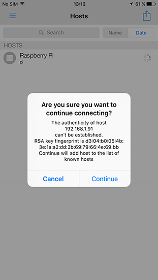

#SSH USING iOS

To use SSH on your mobile device you need to download a client. There are several different good quality clients available, such as [Serverauditor](http://www.serverauditor.com), [Prompt 2](https://panic.com/prompt/), and  [Cathode](http://www.secretgeometry.com/apps/cathode/). 

For the sake of this tutorial we'll use Serverauditor, because it's a popular cross platform SSH client. But the principle is applicable to other clients as well. 

##1. Add your Raspberry pi as a host.
Download Serverauditor from [iTunes](https://itunes.apple.com/en/app/serverauditor-ssh-shell-console/id549039908?mt=8), if you haven’t installed it yet. And click to open the app.

A prompt asking you to allow notifications will pop up, click ‘Allow’ (recommended). Now follow the instructions on the screen, `start by adding a new host`. Tap `New Host` and a new window will pop up.


Enter an `alias`, ‘Raspberry Pi’, for example. Then enter the IP address under `hostname`. Fill out the `username` and `password` and hit ‘save’ in the top right corner. 

If you don't know the IP address just type `hostname -I` in the Raspberry Pi. See more [methods](../ip-address.md) of finding your IP address. The default login for Raspbian is `pi` with the password `raspberry`.


##2. Connect

After you’ve saved the new host, you’ll be sent back to the ‘Hosts’ screen. There you’ll find the new entry. Make sure your mobile device has Wi-Fi turned on and connected to the same network as your Raspberry Pi.

Tap the new entry once, when the connection works you’ll see a [security warning](http://www.lysium.de/blog/index.php?/archives/186-How-to-get-ssh-server-fingerprint-information.html). Don’t worry, everything is fine, click ‘Continue’. You’ll only see this warning the first time Serverauditor connects to a Pi that it hasn’t seen before.



You should now have the Raspberry Pi prompt which will be identical to the one found on the Raspberry Pi itself.

```
pi@raspberrypi ~ $
```

You can type `exit` to close the terminal window.


In case a red exclamation mark will appear, something went wrong. Tap the exclamation mark for the error description. ‘Connection establishment time out.’  means you’ve most likely entered a wrong IP address. Otherwise, Wi-Fi on your mobile device might be turned off, the Raspberry Pi might be turned off,  or it in a different network than your mobile device.

##3. Modify an entry, troubleshooting and more
A connection might be unsuccessful due to various reasons. Most likely your device or Raspberry Pi are [not connected properly](../../configuration/wireless/wireless-cli.md), [SSH is disabled](../../configuration/raspi-config.md), you might have made a typo, or the IP address or credentials have changed. In the latter cases, you need to update the host.

To do so, in the ‘Hosts’ screen, swype the particular host to the left, and new functions will appear. Tap edit. A new screen titled ‘Edit Host’ will pop up.
