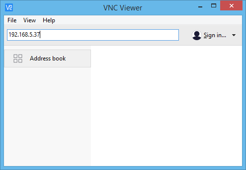
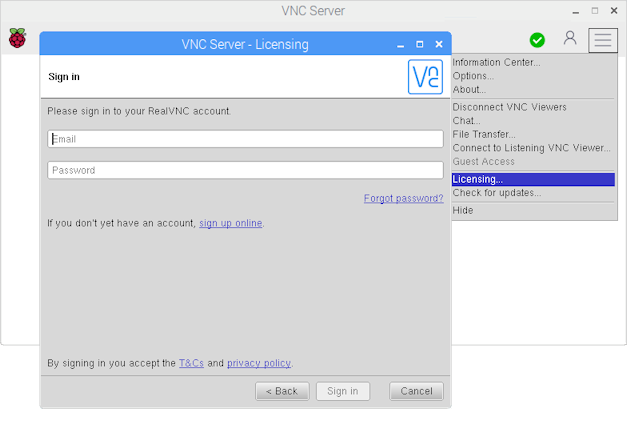
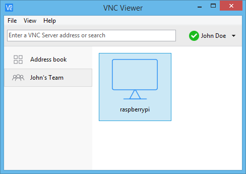
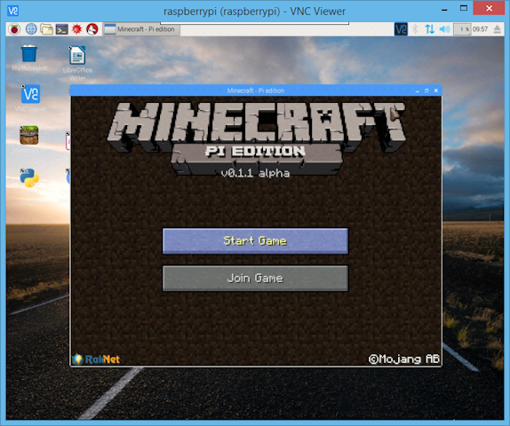

# VNC (Virtual Network Computing)

Sometimes it is not convenient to work directly on the Raspberry Pi. Maybe you would like to work on it from another device by remote control.

VNC is a graphical desktop sharing system that allows you to remotely control the desktop interface of one computer (running a VNC Server) from another computer or mobile device (running a VNC Viewer). VNC Viewer transmits the keyboard and either mouse or touch events to VNC Server, and receives updates to the screen in return.

You will see the desktop of the Raspberry Pi inside a window on your computer or mobile device. You'll be able to control it as though you were working on the Raspberry Pi itself.


VNC® Connect from RealVNC® is included with Raspbian. It consists of both a VNC Server, so you can remotely control your Raspberry Pi, and a VNC Viewer, so you can remotely control desktop computers from your Raspberry Pi should you want to.

You must enable VNC Server; see below for instructions. By default, it gives you remote access to the graphical desktop running on your Raspberry Pi, as though you were sitting in front of it.

However, you can also use VNC Server to gain graphical remote access to your Raspberry Pi if it is headless or not running a graphical desktop; see **Creating a virtual desktop**, further below. 

## Enabling VNC Server

On your Raspberry Pi, run the following command to make sure you have the latest version of VNC Connect:


```bash
sudo apt-get upgrade realvnc-vnc-server realvnc-vnc-viewer
```

Then, enable VNC Server. You can do this graphically or at the command line.

### Enabling VNC Server graphically

- On your Raspberry Pi, boot into the graphical desktop.

- Select **Menu > Preferences > Raspberry Pi Configuration > Interfaces**. 

- Ensure **VNC** is **Enabled**. 

### Enabling VNC Server at the command line

You can enable VNC Server at  the command line using [raspi-config](../../configuration/raspi-config.md):

```bash
sudo raspi-config
```

Now, enable VNC Server by doing the following:

- Navigate to **Advanced Options**.

- Scroll down and select **VNC > Yes**.

## Connecting to your Raspberry Pi with VNC Viewer

There are two ways to connect to your Raspberry Pi; you can use either or both.

### Establishing a direct connection

Direct connections are quick and simple providing you're joined to the same private local network as your Raspberry Pi (for example, a wired or Wi-Fi network at home, school or in the office).

- On your Raspberry Pi (using Terminal or via SSH) use [these instructions](../ip-address.md) or run `ifconfig` to discover your private IP address. 

- On the device you'll use to take control, download VNC Viewer. For best results, use the [compatible app](https://www.realvnc.com/download/viewer/) from RealVNC. 

- Enter your Raspberry Pi's private IP address into VNC Viewer:

  

### Establishing a cloud connection

You are entitled to use RealVNC's cloud service for free providing remote access is for educational or non-commercial purposes only.

Cloud connections are convenient and encrypted end-to-end, and highly recommended for connecting to your Raspberry Pi over the Internet. There's no firewall or router reconfiguration, and you don't need to know the IP address of your Raspberry Pi, or provide a static one.

- Sign up for a RealVNC account [here](https://www.realvnc.com/raspberrypi/#sign-up); it's free and only takes a few seconds.

- On your Raspberry Pi, sign in to VNC Server using your new RealVNC account credentials:

  

- On the device you'll use to take control, download VNC Viewer. You *must* use the [compatible app](https://www.realvnc.com/download/viewer/) from RealVNC.

- Sign in to VNC Viewer using the same RealVNC account credentials, and then either tap or click to connect to your Raspberry Pi:

  

### Authenticating to VNC Server

To complete either a direct or cloud connection, you must authenticate to VNC Server. 

If you're connecting from the [compatible VNC Viewer app](https://www.realvnc.com/download/viewer/) from RealVNC, enter the user name and password you normally use to *log in* to your user account on the Raspberry Pi. By default, these credentials are `pi` and `raspberry`.

If you're connecting from a non-RealVNC Viewer app, you'll first need to downgrade VNC Server's authentication scheme, specify a password unique to VNC Server, and then enter that instead. To do this, open the VNC Server dialog on your Raspberry Pi, select **Menu > Options > Security**, and choose  **VNC password** from the **Authentication** dropdown.

## Playing Minecraft and other directly rendered apps remotely

You can remotely access apps which use a directly rendered overlay, such as Minecraft, the text console, the Pi camera module, and more.



To turn this feature on:

- On your Raspberry Pi, open the VNC Server dialog. 

- Navigate to **Menu > Options > Troubleshooting** and select **Enable experimental direct capture mode**.

- On the device you'll use to take control, run VNC Viewer and connect.

  **Note:** Existing connections must be restarted in order for these changes to take effect.

Please note that direct screen capture is an experimental feature. If you're connecting from a desktop computer and mouse movements seem erratic, try pressing F8 to open the VNC Viewer shortcut menu and selecting **Relative Pointer Motion**.

If performance seems impaired, try [these troubleshooting steps](https://www.realvnc.com/docs/raspberry-pi.html#raspberry-pi-minecraft-troubleshoot), or [let RealVNC know](https://support.realvnc.com/index.php?/Tickets/Submit).

## Creating a virtual desktop

If your Raspberry Pi is headless (not plugged into a monitor) or controlling a robot, it is unlikely to be running a graphical desktop.

VNC Server can create a *virtual desktop* for you, giving you graphical remote access on demand. This virtual desktop exists only in your Raspberry Pi's memory:


To create and connect to a virtual desktop: 

- On your Raspberry Pi (using Terminal or via SSH), run `vncserver`. Make note of the IP address/display number that VNC Server will print to your Terminal (e.g. `192.167.5.149:1`).

- On the device you'll use to take control, enter this information into [VNC Viewer](https://www.realvnc.com/download/viewer/).

To destroy a virtual desktop, run the following command: 

```bash
vncserver -kill :<display-number>
```

This will also stop any existing connections to this virtual desktop.
