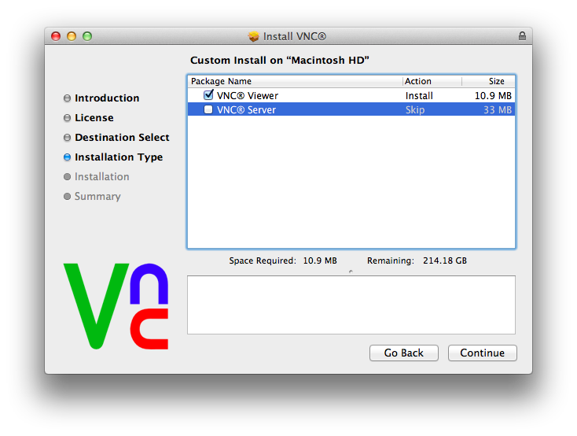
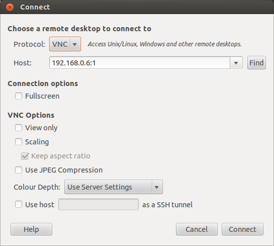

# VNC, Virtual Network Computing

## Introduction
Sometimes it is not convenient to work directly on the Raspberry Pi. Maybe you would like to work on it but from another computer by remote control.

VNC is a graphical desktop sharing system that allows you to remotely control the desktop interface of one computer from another.  It transmits the keyboard and mouse events from the controller and receives back updates to the screen over the network from the remote host.

You will see the desktop of the Raspberry Pi inside a window on your PC/Laptop.  You’ll be able to control it as though you were working on the Raspberry Pi itself.

## How does it work

The commands described below start a "virtual" graphical session. Instead of using a hardware framebuffer, this uses RAM for a framebuffer. It also opens a network channel or port that allows programs on other computers (if they provide the password) to show the framebuffer and provide mouse and keyboard events.

This way you can run a desktop session on the Raspberry Pi, but display and control it elsewhere.

Because the framebuffer isn't the real framebuffer you cannot take advantage of the GPU to accelerate operations on the screen.

## Why should you use it?
VNC is ideal if you don’t have enough space to set up a keyboard, mouse and monitor for a Raspberry Pi.  If you use VNC you’ll only need to connect the Raspberry Pi to your network and plug in its power.

## Instructions

- On your Pi (using a monitor or via [SSH](ssh.md)), install the TightVNC package:

```
sudo apt-get install tightvncserver
```

- Next Run TightVNC Server which will prompt you to enter a Password and an optional View Only Password

```
tightvncserver
```

- Start a VNC server from the shell prompt. This example starts a session on VNC display zero (```:0```) with full HD resolution:

```
vncserver :0 -geometry 1920x1080 -depth 24
```

- Now on your computer, install and run the VNC client:

    - On a Linux machine install the package ```xtightvncviewer```

        e.g. ```sudo apt-get install xtightvncviewer```

    - Otherwise, TightVNC is downloadable from [tightvnc.com](http://www.tightvnc.com/download.php)

### Automation and run at boot

You can create a simple file with the command to run the VNC server on the Pi, to save having to remember it:

- Create a file containing:

```
#!/bin/sh
vncserver :0 -geometry 1920x1080 -depth 24 -dpi 96
```

- Save this as ```vnc.sh``` (example)

- Make the file executable:

```
chmod +x vnc.sh
```

- Then run at any time with:

```
./vnc.sh
```

To run at boot:

- Log in to a root shell on the Pi:

```
sudo su
```

- Navigate to the directory ```/etc/init.d/```:

```
cd /etc/init.d/
```

- Create a new file here containing the following script:

```
### BEGIN INIT INFO
# Provides: vncboot
# Required-Start: $remote_fs $syslog
# Required-Stop: $remote_fs $syslog
# Default-Start: 2 3 4 5
# Default-Stop: 0 1 6
# Short-Description: Start VNC Server at boot time
# Description: Start VNC Server at boot time.
### END INIT INFO

#! /bin/sh
# /etc/init.d/vncboot

USER=root
HOME=/root

export USER HOME

case "$1" in
 start)
   echo "Starting VNC Server"
   #Insert your favoured settings for a VNC session
   /usr/bin/vncserver :0 -geometry 1280x800 -depth 16 -pixelformat rgb565
   ;;

 stop)
   echo "Stopping VNC Server"
   /usr/bin/vncserver -kill :0
   ;;

 *)
   echo "Usage: /etc/init.d/vncboot {start|stop}"
   exit 1
   ;;
esac

exit 0
```

- Save this file as ```vncboot``` (example)

- Make this file executable:

```
chmod 755 vncboot
```

- Enable dependency based boot sequencing:

```
update-rc.d /etc/init.d/vncboot defaults
```

- If enabling dependency based boot sequencing was successful, it says:

```
update-rc.d: using dependency based boot sequencing
```

- But if it says:

```
update-rc.d: error: unable to read /etc/init.d//etc/init.d/vncboot
```

- then try the following command:

```
update-rc.d vncboot defaults
```

- Reboot your Raspberry Pi and you should find a vncserver already started

You’ll now use a VNC *client* program on your PC/Laptop to connect to the VNC server and take control of it.  Below are separate instructions for Windows, OSX and Linux.

[](#microsoft-windows-xp-visa-7-and-8)
[](#apple-os-x-all-versions)
[](#ubuntulinux)

##Microsoft Windows (XP, Visa, 7 and 8)

On Windows you’ll need to download and install a VNC client program.  A commonly used one is TightVNC which can be downloaded from here: http://www.tightvnc.com/download.php

Choose either the 32 or 64 bit download depending on which version of Windows you are using.  If you don’t know then check by looking at System in Control Panel.  Download the installer file and run it.

During installation you’ll be offered the choice of Typical, Custom or Complete.  You only need the VNC client and not the server, so choose Custom.  Then select *TightVNC Server* and choose *Entire feature will be unavailable*.  Click Next.  Uncheck the option about Windows Firewall and click Next again, then Install.


Once the installation is complete you should find TightVNC Viewer under the start menu.  When you run it you’ll be presented with the dialog below.  You will need to enter the IP address of the Raspberry Pi followed by the screen number (:0 or :1).  For example: `192.168.0.6:1`


Click the *Connect* button and you will be prompted for the password that was specified when configuring the VNC server on the Raspberry Pi earlier.  You should then find yourself at the Raspberry Pi desktop.


Don’t use the *logout* menu as you would on the Raspberry Pi desktop when you want to close down.  Just close the TightVNC window itself and then use the kill command on the Raspberry Pi, described above, to shut down the VNC server.

For further documentation about TightVNC Viewer please visit this page: http://www.tightvnc.com/docs.php

##Apple OS X (all versions)

For OS X you’ll need to install a VNC viewer program.  You can use Screen Sharing (which comes installed as standard) but this is a bit more of a fiddle to get working.  Feel free to Google it though.  There is a program called RealVNC which is known to work with the Raspberry Pi VNC server, it can be downloaded from here: http://www.realvnc.com/download/vnc/latest/

Download the package file and open it.  During the setup you’ll be offered a choice of the type of installation.  You only need the VNC viewer on your Mac and not the server so select custom and then *uncheck* VNC Server (see below).



Click continue and go ahead with the rest of the installation.  Once the installation is complete open the finder, then select Applications on the left and enter vnc into the search box.  VNC Viewer should then be shown.  Perhaps create a shortcut to it in your Dock for future use.


When you run it you’ll be presented with the dialog above.  You will need to enter the IP address of the Raspberry Pi followed by the screen number (:0 or :1).  For example: 192.168.0.165:1

Click the Connect button and you’ll be given an unencrypted connection warning.


Generally speaking this warning only needs consideration if the connection between your Mac and the Pi is going over the Internet.  If you’re using a Local Area Network or a School network then you don’t really need to worry.  Click *Continue* and you’ll be prompted for the password that was specified when configuring the VNC server on the Raspberry Pi earlier.  You should then find yourself at the Raspberry Pi desktop.


Don’t use the *logout* menu as you would on the Raspberry Pi desktop when you want to close down.  Just close the RealVNC window itself and then use the kill command on the Raspberry Pi, described above, to shut down the VNC server.

For further documentation on RealVNC please visit this page: http://www.realvnc.com/products/vnc/documentation/latest/

##Ubuntu/Linux

Under Linux there should be a program called *Remote Desktop Viewer* that you can use (depending on which distribution you’re using).  This can be found under the Applications / Internet menu (see below).


Once you have the Remote Desktop Viewer open click the connect button and you’ll be see the following dialog.  Set the Protocol option to `VNC` and enter the IP address of the Raspberry Pi followed by the screen number (:0 or :1).  For example: `192.168.0.6:1`



Click the Connect button and you will be prompted for the password that was specified when configuring the VNC server on the Raspberry Pi earlier.  You should then find yourself at the Raspberry Pi desktop.


Don’t use the logout menu as you would on the Raspberry Pi desktop when you want to close down.  Just close the Remote Desktop Viewer window itself and then use the kill command on the Raspberry Pi, described above, to shut down the VNC server.

An alternative program is **Remmina Remote Desktop Client** which can be obtained here: http://remmina.sourceforge.net/
